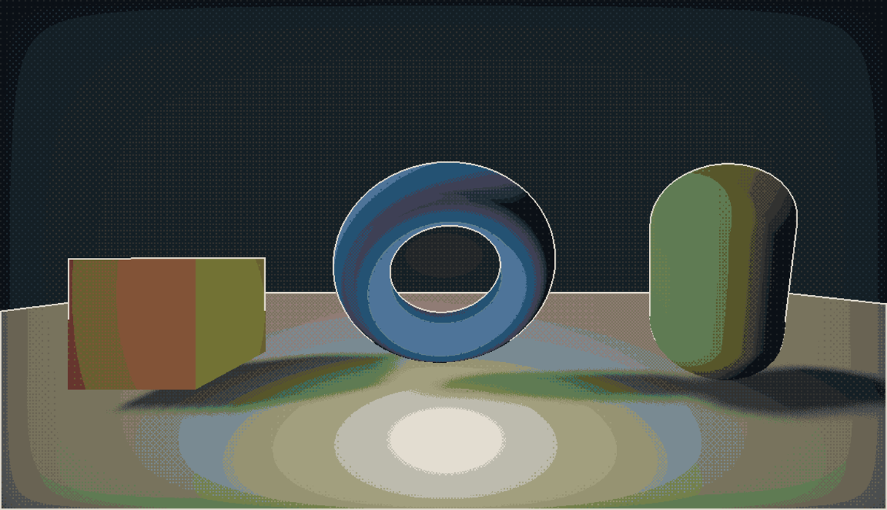

# SharpAcompute

_The plugin is currently at version 0.6. I will consider upgrading it to 1.0 when more people have tested it to make sure there aren't any major bugs.  
Hot-Reloading is now also supported!*_
***

A C# godot plugin implementation of [Acerolas Acompute](https://github.com/GarrettGunnell/Acerola-Compute) that makes working with the new `EffectCompositor` _slightly_ less painful.  
Tested in Godot version 4.4-mono
***
- Features a GLSL compute shader wrapper language called `Acompute`.
- Several wrappers to make creating EffectCompositor effects simpler
- Hot reloading of shaders
- Memory management of created shaders
- Some examples

***
### Installation:
Installed like any other Godot plugin. Instructions can be found [here](https://docs.godotengine.org/en/stable/tutorials/plugins/editor/installing_plugins.html).

***
### Creating new effects:
Each effects consists of two files.  

1. ### AcomputeShaderResource
    `AcomputeShaderResource` is a `.tres` resource containing your provided GLSL code. The **recommended** way of creating a new resource of this type is to drag and drop a text file with the extension `.acompute`.  
    >The plugin contains an importer that will automatically create the `.tres` file off the provided `.acompute` file in the background saving it under `.godot\imported`.  

    The reason this way is preferred is that you can use an external file editor like **notepad++** that has correct GLSL syntax-highlighting to work with your shader. Saving your shader in any external software is enough for the plugin to recompile and reload it.  
   - The other way would be to create a new resource deriving from `AcomputeShaderResource` directly from within the editor. In that case you will have to use the property inspector window to modify your code, though hot-reloading still works on save. 

2. ### AcomputeCompositorEffect
    Create a new class inheriting from `AcomputeCompositorEffect`. Set up all your logic here that will be dispatched to the `AcomputeShaderResource`. Refer to the examples for more info.
***
#### Example notes:
`AcomputeShaderResources` created using the `.acompute` import can not be quick loaded **if they are in the addons folder**. In that case just drag and drop the file into the exported field.
